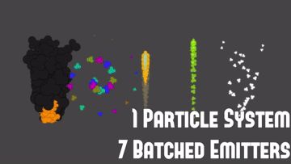

# Batched Particle Systems
Simple scripts that leverage ParticleSystem.Emit() and the ParticleSystem.EmitParams structure to allow multiple instances of similar particle systems to be batched into a single particle system with multiple emitters.

## Usage
Attach the BatchedParticleSystem component to the same GameObject as your main particle system.  Attach the BatchedParticleEmitter to any GameObject that you would like to emit particles in that system, and add them to the BatchParticleSystems emitter list. Then, tweak the override settings on each emitter to achieve your desired effect.

[More Info Here](https://www.grizzly-machine.com/entries/drawing-multiple-effects-with-one-particle-system)
