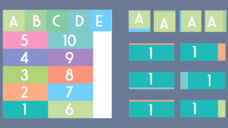
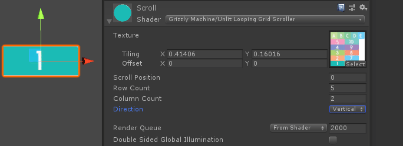

# Grid Scrolling Shader
This simple unlit shader endlessly scrolls through a grid of cells within a texture. It supports scrolling vertically or horizontally, and can work within a subset of the texture to allow for atlassing.

[More info and tutorial here.](https://www.grizzly-machine.com/entries/tutorial-looped-grid-scrolling-shader)

## Usage
Create a material with this shader and assign your grid texture to the Main Texture slot. Enter the width and height of the grid-cells in the x and y tiling properties of the texture (you can calculate this number by taking the dimensions of the cell in pixels and dividing by the dimensions of the texture in pixels). If your grid is not anchored at the bottom-left corner of the texture, use the offset property to define the starting position of the grid. Finally, enter the number of rows and columns in their respective properties, and use the scroll position property to animate your effect.
